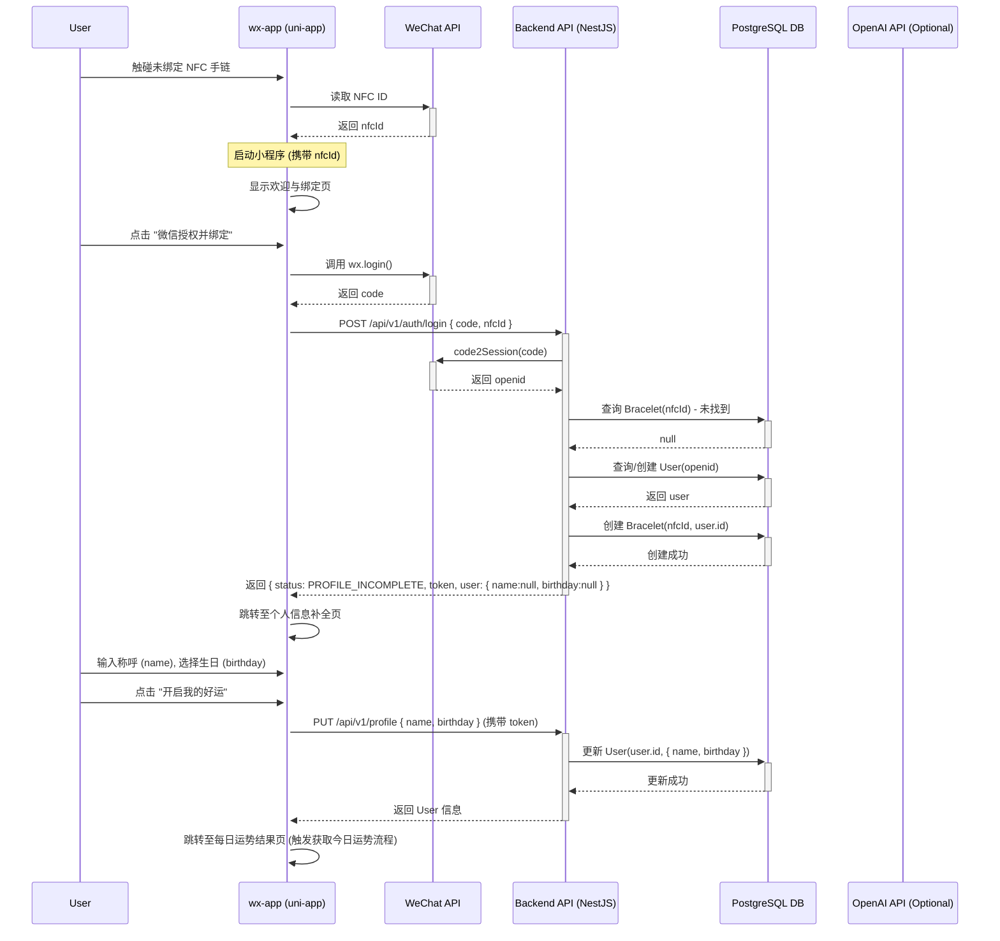
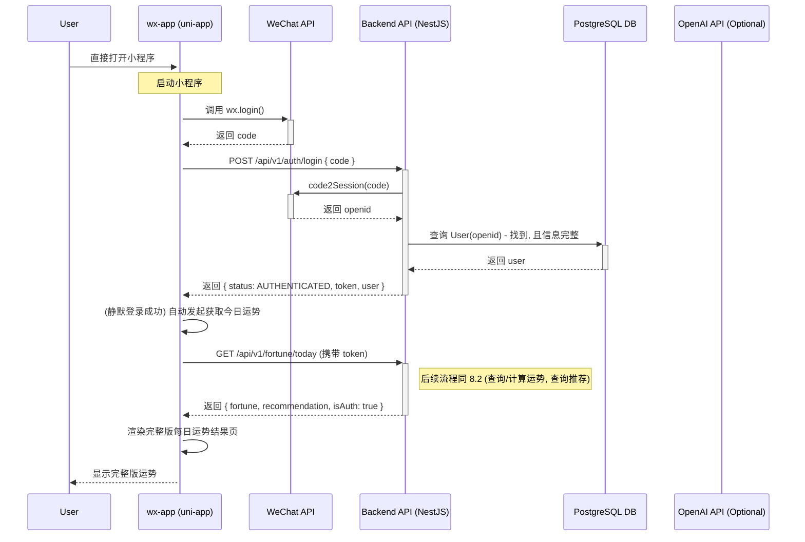
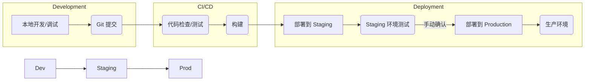

# “专属NFC手链运势”微信小程序 Fullstack Architecture Document

## 1. 引言（index.md）

本文档阐述了“专属NFC手链运势”微信小程序的整体技术架构。该项目采用 **uni-app 框架** 进行开发，主要目标平台为**微信小程序**。本文档旨在为 AI 驱动的开发提供清晰的技术蓝图，确保前端（基于 uni-app 和 Vue.js）、后端（Node.js/TypeScript）、数据库（PostgreSQL）以及 AI 服务（OpenAI 兼容 API）之间的协调一致和高效集成。

**关键技术选型**:

- **开发框架**: uni-app (基于 Vue.js 3 语法)
- **构建工具**: Vite
- **编程语言**: TypeScript
- **目标平台**: 微信小程序
- **后端数据库**: PostgreSQL (自建服务器)
- **AI 服务**: OpenAI 兼容 API

### 1.1 Starter Template or Existing Project

- **状态**: Greenfield project (全新项目)。
- **Starter Template**: 确认采用 **uni-app 官方 Vue3 + Vite + TypeScript 模板**。这将提供基础的项目结构、Vite 构建支持、TypeScript 集成和 Vue 3 组合式 API 的基础。

### 1.2 Change Log

| Date           | Version | Description                                    | Author    |
| :------------- | :------ | :--------------------------------------------- | :-------- |
| 2025年10月24日 | 0.1     | 初稿，定义引言和关键技术选型                   | Architect |
| 2025年10月24日 | 0.2     | 确认采用 uni-app Vue3+Vite+TS starter template | Architect |
| 2025年10月24日 | 0.3     | 根据 Checklist 结果进行细化和优化              | Architect |

---

## 2. 高层架构（high-level-architecture.md）

### 2.1 技术概要

本系统采用**前后端分离**的架构模式。前端使用 **uni-app 框架 (Vue3 + Vite + TypeScript)** 开发，编译为**微信小程序**运行。后端采用 **Node.js + TypeScript** (选用 **NestJS** 框架)，提供 RESTful API 接口。数据存储在**自建的 PostgreSQL** 数据库中。通过微信 JSSDK 获取用户信息 (OpenID)，通过微信小程序 NFC API 读取手链 ID。运势计算或内容生成可能调用**外部 OpenAI 兼容 API**。整体部署在**自建服务器**环境（数据库）及可能的云服务（后端 API）。核心交互是 NFC 触碰快速拉起小程序展示个性化数据。

### 2.2 平台和基础设施选择

- **前端运行平台**: 微信小程序。
- **后端 API 部署**: 自建服务器（或云服务器，如阿里云 ECS /腾讯云 CVM）。需要 Node.js 运行环境。
- **数据库**: PostgreSQL，部署在自建服务器上。
- **AI 服务**: 通过 HTTPS 调用外部 OpenAI 兼容 API 服务。
- **NFC 读取**: 依赖微信小程序提供的 NFC 相关 API。

### 2.3 仓库结构

- **结构**: 采用 **Monorepo** 结构，便于管理前后端代码和共享类型/工具函数。
- **Monorepo 工具**: 选用 **pnpm workspaces** 来管理。
- **包组织 (示例)**:
  - `apps/wx-app`: uni-app 前端代码。
  - `apps/api`: 后端 API 服务代码 (NestJS)。
  - `packages/shared-types`: 前后端共享的 TypeScript 类型定义。
  - `packages/db-client`: 数据库交互模块（可选，Prisma Client 通常直接在后端使用）。

### 2.4 高层架构图

```mermaid
graph TD
    subgraph 用户设备
        A[微信小程序 on 手机] -- NFC读取 --> B((NFC手链));
        A -- HTTPS --> D[后端 API 服务 (NestJS)];
    end

    subgraph 后端服务 (自建/云服务器)
        D -- SQL (Prisma) --> E[PostgreSQL数据库 (自建)];
        D -- HTTPS --> F[OpenAI兼容API (外部)];
        D -- 微信API --> G[微信登录接口];
    end

    A -- 调用 --> G;

    style B fill:#f9f,stroke:#333,stroke-width:2px;
    style E fill:#ccf,stroke:#333,stroke-width:2px;
    style F fill:#9cf,stroke:#333,stroke-width:2px;
```

### 2.5 架构模式

- **前后端分离**: 前端 (uni-app) 与后端 (API) 通过接口解耦。
- **API 驱动**: 采用 RESTful API 作为前后端通信标准。
- **单体服务 (Monolith)**: 鉴于项目 V1.0 规模，采用**单体服务**构建后端 API (NestJS)，易于开发和部署。若未来功能复杂度大幅增加，可考虑拆分为微服务。
- **事件驱动 (可选)**: 暂不引入复杂事件驱动机制，未来可按需添加。
- **组合式 API (Vue 3)**: uni-app 前端采用 Vue 3 的组合式 API 风格组织逻辑。
- **模块化 (NestJS)**: 后端采用 NestJS 的模块化设计组织代码。
- **依赖注入 (NestJS)**: 后端利用 NestJS 的 DI 容器管理服务依赖。

---

## 3. 技术栈（tech-stack.md）

此技术栈基于项目需求（uni-app 编译微信小程序、自建 PostgreSQL、OpenAI 兼容 API）以及高层架构决策（Vue 3 + Vite + TypeScript 前端、Node.js + NestJS + TypeScript 后端、Monorepo）确定。**所有版本号均为建议的稳定版本，开发前需确认兼容性。**

### 3.1 Technology Stack Table

| Category                | Technology                       | Version         | Purpose                         | Rationale                                                                      |
| :---------------------- | :------------------------------- | :-------------- | :------------------------------ | :----------------------------------------------------------------------------- |
| **Frontend Framework**  | uni-app                          | ^3.x.x          | 跨平台开发框架 (目标微信小程序) | 项目核心要求，使用 Vue 3 语法                                                  |
| **Frontend Language**   | TypeScript                       | ^5.x.x          | 前端编程语言                    | 类型安全，与 uni-app Vue3 模板兼容                                             |
| **Frontend UI Library** | uView UI 2.x                     | latest stable   | uni-app 组件库                  | 功能丰富，社区活跃，加速 UI 开发                                               |
| **State Management**    | Pinia                            | ^2.x.x          | 前端状态管理                    | Vue 3 官方推荐，与 uni-app(Vue3) 兼容良好                                      |
| **Build Tool**          | Vite                             | ^5.x.x          | 前端构建工具                    | uni-app Vue3 模板集成，提供快速开发和构建体验                                  |
| **Backend Language**    | TypeScript                       | ^5.x.x          | 后端编程语言                    | 与前端统一，类型安全，Node.js 生态成熟                                         |
| **Backend Framework**   | NestJS                           | ^10.x.x         | 后端 Node.js 框架               | 提供优秀的项目结构、模块化、依赖注入，适合构建稳定 API，对 TypeScript 支持极佳 |
| **API Style**           | RESTful                          | N/A             | 前后端通信协议                  | 成熟、标准、易于理解和实现                                                     |
| **Database**            | PostgreSQL                       | 15.x / 16.x     | 核心关系型数据库                | 项目要求，功能强大，稳定可靠                                                   |
| **ORM / DB Client**     | Prisma                           | ^5.x.x          | 数据库交互与类型安全            | 提供优秀的 TypeScript 集成和类型生成，简化数据库操作，适用于 PostgreSQL        |
| **AI Service Client**   | axios / node-fetch               | latest stable   | 调用 OpenAI 兼容 API            | 标准的 HTTP 客户端库                                                           |
| **Authentication**      | JWT (JSON Web Tokens) + 微信登录 | N/A             | 用户认证与会话管理              | 结合微信 OpenID 实现无状态认证，适用于前后端分离架构                           |
| **Monorepo Tool**       | pnpm workspaces                  | ^8.x.x / ^9.x.x | 管理 Monorepo                   | 轻量、高效，利用符号链接节省磁盘空间并简化依赖管理                             |
| **Testing (Frontend)**  | Vitest                           | ^1.x.x          | uni-app / Vue 单元/集成测试     | 与 Vite 集成良好，提供 Jest 兼容的 API                                         |
| **Testing (Backend)**   | Jest                             | ^29.x.x         | NestJS 单元/集成测试            | NestJS 官方集成，生态成熟                                                      |
| **Testing (E2E)**       | uni-app uts (uni test system)    | latest stable   | 端到端测试                      | uni-app 官方推荐，与框架结合更紧密                                             |
| **IaC Tool (Optional)** | Terraform / Pulumi               | latest stable   | 基础设施即代码 (若后端部署于云) | (若需要云部署) 实现基础设施自动化管理                                          |
| **CI/CD**               | GitHub Actions / GitLab CI       | N/A             | 持续集成与持续部署              | 主流 CI/CD 平台，可自动化构建、测试、部署流程                                  |
| **Logging (Backend)**   | Pino / Winston                   | latest stable   | 后端日志记录                    | 高性能日志库                                                                   |
| **Error Tracking**      | Sentry (可选, 可自部署)          | N/A             | 前后端错误监控                  | 集中收集和管理应用错误                                                         |

## 4. 数据模型 (Data Models)（data-models.md）

本节定义了应用所需的核心数据实体及其关系。这些模型将映射到 PostgreSQL 数据库表，并通过 Prisma 进行交互。TypeScript 接口定义在 `packages/shared-types` 中共享。

### 4.1 核心实体

- **User**: 代表小程序用户，通过微信 OpenID 唯一标识。存储用户的基本信息。
- **Bracelet**: 代表一个物理 NFC 手链，具有唯一的 NFC ID，并关联到绑定的用户。
- **DailyFortune**: 存储用户每日的运势计算结果。
- **Product**: 代表可供推荐的手链商品。

### 4.2 实体定义与 TypeScript 接口

#### 4.2.1 User

- **用途**: 存储用户信息，关联微信身份。
- **关键属性**: 微信 OpenID, 用户称呼, 生日。
- **关系**: 一个用户可以绑定多个手链 (`1..*`)；一个用户有多条每日运势记录 (`1..*`)。

```typescript
// packages/shared-types/src/user.ts
export interface User {
  id: string; // UUID or database auto-increment ID
  wechatOpenId: string; // 微信 OpenID, Unique
  name: string | null; // 用户称呼
  birthday: Date | null; // 用户生日 (公历)
  createdAt: Date;
  updatedAt: Date;

  // Relations (managed by ORM/Prisma)
  // bracelets?: Bracelet[];
  // dailyFortunes?: DailyFortune[];
}
```

#### 4.2.2 Bracelet

- **用途**: 存储 NFC 手链信息及其绑定状态。
- **关键属性**: NFC ID, 关联的用户 ID。
- **关系**: 每个手链最多绑定一个用户 (`*..1`)。

<!-- end list -->

```typescript
// packages/shared-types/src/bracelet.ts
export interface Bracelet {
  id: string; // UUID or database auto-increment ID
  nfcId: string; // 手链 NFC ID, Unique
  userId: string | null; // FK to User.id, null if unbound
  boundAt: Date | null; // 绑定时间
  createdAt: Date;
  updatedAt: Date;

  // Relations (managed by ORM/Prisma)
  // user?: User | null;
}
```

#### 4.2.3 DailyFortune

- **用途**: 存储用户每一天的运势结果，用于展示和历史回顾。
- **关键属性**: 用户 ID, 日期, 综合分数, 各项分值/提示。
- **关系**: 每条运势记录属于一个用户 (`*..1`)；可能关联一个推荐商品 (`*..0..1`)。
- **约束**: `userId` + `date` 组合应唯一。

<!-- end list -->

```typescript
// packages/shared-types/src/dailyFortune.ts
export interface DailyFortune {
  id: string; // UUID or database auto-increment ID
  userId: string; // FK to User.id
  date: Date; // 运势对应的日期 (YYYY-MM-DD)
  score: number; // 综合分数 (e.g., 0-100)
  comment: string; // 一句话点评
  careerScore: number; // 事业运分数/星级 (e.g., 1-5)
  wealthScore: number; // 财富运分数/星级
  loveScore: number; // 爱情运分数/星级
  goodElement: string | null; // 今日喜用 (e.g., "金, 水")
  luckyColor: string | null; // 幸运色
  goodFor: string | null; // 宜 (e.g., "合作")
  recommendedProductId: string | null; // FK to Product.id, 可选的当日推荐商品
  createdAt: Date;

  // Relations (managed by ORM/Prisma)
  // user?: User;
  // recommendedProduct?: Product | null;
}
```

#### 4.2.4 Product

- **用途**: 存储手链商品信息，用于“今日开运手链推荐”模块。
- **关键属性**: 商品名称, 描述, 图片链接, 抖音链接, 推荐规则相关属性 (可选)。
- **关系**: 一个商品可能被推荐在多条每日运势中 (`1..*`)。

<!-- end list -->

```typescript
// packages/shared-types/src/product.ts
export interface Product {
  id: string; // UUID or database auto-increment ID
  name: string; // 商品名称 (e.g., "蓝宝石手链")
  description: string; // 一句话推荐语 (e.g., "五行属水, 完美契合...")
  imageUrl: string; // 商品图片 URL
  douyinLink: string; // 跳转的抖音店铺链接 (或是商品专属链接?)
  // Optional attributes for recommendation logic, e.g.:
  // scoreRangeLow?: number; // 推荐给运势分数在此范围的用户
  // scoreRangeHigh?: number;
  // associatedElement?: string; // 推荐给喜用为此元素的用户
  createdAt: Date;
  updatedAt: Date;

  // Relations (managed by ORM/Prisma)
  // dailyFortunesRecommendedOn?: DailyFortune[];
}
```

### 4.3 关系图 (ER Diagram - Conceptual)

```mermaid
erDiagram
    USER ||--o{ BRACELET : binds
    USER ||--|{ DAILY_FORTUNE : has
    PRODUCT ||--o{ DAILY_FORTUNE : recommends

    USER {
        string id PK
        string wechatOpenId UK
        string name NULL
        date birthday NULL
        datetime createdAt
        datetime updatedAt
    }

    BRACELET {
        string id PK
        string nfcId UK
        string userId FK NULL
        datetime boundAt NULL
        datetime createdAt
        datetime updatedAt
    }

    DAILY_FORTUNE {
        string id PK
        string userId FK
        date date
        int score
        string comment
        int careerScore
        int wealthScore
        int loveScore
        string goodElement NULL
        string luckyColor NULL
        string goodFor NULL
        string recommendedProductId FK NULL
        datetime createdAt
        -- UK(userId, date)
    }

    PRODUCT {
        string id PK
        string name
        string description
        string imageUrl
        string douyinLink
        -- Optional recommendation attributes
        datetime createdAt
        datetime updatedAt
    }

```

---

## 5. API 规范 (API Specification)（api-specification.md）

本应用采用 RESTful API 风格进行前后端通信。以下是基于 OpenAPI 3.0 规范的 API 定义。

```yaml
openapi: 3.0.0
info:
  title: 专属NFC手链运势 API
  version: 1.0.0
  description: 后端 API 服务，为 uni-app 微信小程序提供数据支持。
servers:
  - url: /api/v1 # 基础路径，具体 URL 待定
    description: Development server

# 安全方案: 使用 JWT Bearer Token 进行认证
security:
  - bearerAuth: []

paths:
  /auth/login:
    post:
      summary: 用户登录/注册/绑定验证
      description: 使用微信 code 进行登录或注册，可选携带 nfcId 进行绑定或状态检查。
      requestBody:
        required: true
        content:
          application/json:
            schema:
              type: object
              properties:
                code:
                  type: string
                  description: 微信 wx.login() 获取的 code
                nfcId:
                  type: string
                  description: (可选) 通过 NFC 读取到的手链 ID
              required:
                - code
      responses:
        '200':
          description: 登录/验证成功
          content:
            application/json:
              schema:
                type: object
                properties:
                  status:
                    type: string
                    enum: [AUTHENTICATED, PROFILE_INCOMPLETE, VISITOR_PREVIEW]
                    description: |
                      - AUTHENTICATED: 已认证用户，返回 token
                      - PROFILE_INCOMPLETE: 新用户或未填信息，需跳转信息补全页，返回 token
                      - VISITOR_PREVIEW: 触碰他人手链，仅显示预览，不返回 token (可能附带预览数据)
                  token:
                    type: string
                    description: JWT Bearer Token (仅在 AUTHENTICATED 和 PROFILE_INCOMPLETE 时返回)
                  user:
                    $ref: '#/components/schemas/UserPartial'
                    description: 用户基本信息 (可能不完整)
                  # Optional for VISITOR_PREVIEW status (方案 C)
                  previewScore:
                    type: number
                    description: 通用预览分数 (仅 VISITOR_PREVIEW 时)
                  recommendation:
                    $ref: '#/components/schemas/Product'
                    description: 通用推荐商品 (仅 VISITOR_PREVIEW 时)
        '400':
          description: 请求参数错误 (例如 code 无效)
        '500':
          description: 服务器内部错误

  /profile:
    put:
      summary: 更新用户信息
      description: 更新用户的称呼和生日信息。需要认证。
      security:
        - bearerAuth: []
      requestBody:
        required: true
        content:
          application/json:
            schema:
              type: object
              properties:
                name:
                  type: string
                  description: 用户称呼
                birthday:
                  type: string
                  format: date
                  description: 用户生日 (YYYY-MM-DD)
              required:
                - name
                - birthday
      responses:
        '200':
          description: 用户信息更新成功
          content:
            application/json:
              schema:
                $ref: '#/components/schemas/User'
        '400':
          description: 请求参数校验失败
        '401':
          description: 未授权
        '500':
          description: 服务器内部错误

  /fortune/today:
    get:
      summary: 获取今日运势
      description: 获取当前认证用户的今日运势。服务器根据 token 判断用户状态返回完整或部分数据。
      security:
        - bearerAuth: [] # 认证用户需要 Token
      responses:
        '200':
          description: 获取成功
          content:
            application/json:
              schema:
                type: object
                properties:
                  fortune:
                    $ref: '#/components/schemas/DailyFortune'
                    description: 运势数据 (访客模式下可能仅包含部分字段)
                  recommendation:
                    $ref: '#/components/schemas/Product'
                    description: 推荐商品
                  isAuth:
                    type: boolean
                    description: 告知前端当前用户是否已认证 (绑定手链)
        '401':
          description: 未授权 (Token 无效或过期)
        '404':
          description: 未找到用户信息 (理论上不应发生，因为 token 有效)
        '500':
          description: 服务器内部错误

  /fortune/history:
    get:
      summary: 获取历史运势列表
      description: 获取当前认证用户的历史运势记录（分页）。需要认证。
      security:
        - bearerAuth: []
      parameters:
        - name: page
          in: query
          description: 页码 (从 1 开始)
          required: false
          schema:
            type: integer
            default: 1
        - name: limit
          in: query
          description: 每页数量
          required: false
          schema:
            type: integer
            default: 20
      responses:
        '200':
          description: 获取成功
          content:
            application/json:
              schema:
                type: object
                properties:
                  items:
                    type: array
                    items:
                      $ref: '#/components/schemas/DailyFortuneSummary' # 仅概要信息
                  total:
                    type: integer
                  page:
                    type: integer
                  limit:
                    type: integer
                  hasMore:
                    type: boolean
        '401':
          description: 未授权
        '500':
          description: 服务器内部错误

  /fortune/{date}:
    get:
      summary: 获取指定日期运势
      description: 获取当前认证用户指定日期的运势详情。需要认证。
      security:
        - bearerAuth: []
      parameters:
        - name: date
          in: path
          required: true
          description: 日期 (YYYY-MM-DD)
          schema:
            type: string
            format: date
      responses:
        '200':
          description: 获取成功
          content:
            application/json:
              schema:
                type: object # 统一返回结构
                properties:
                  fortune:
                    $ref: '#/components/schemas/DailyFortune'
                  recommendation:
                    $ref: '#/components/schemas/Product' # 也返回当日推荐
        '401':
          description: 未授权
        '404':
          description: 未找到指定日期的运势记录
        '500':
          description: 服务器内部错误

components:
  securitySchemes:
    bearerAuth:
      type: http
      scheme: bearer
      bearerFormat: JWT

  schemas:
    User:
      type: object
      properties:
        id:
          type: string
        wechatOpenId:
          type: string
        name:
          type: string
          nullable: true
        birthday:
          type: string
          format: date
          nullable: true
        createdAt:
          type: string
          format: date-time
        updatedAt:
          type: string
          format: date-time

    UserPartial: # 用于登录返回，可能不完整
      type: object
      properties:
        name:
          type: string
          nullable: true
        birthday:
          type: string
          format: date
          nullable: true

    Bracelet: # 主要通过 /auth/login 关联，暂无独立操作接口
      type: object
      properties:
        id:
          type: string
        nfcId:
          type: string
        userId:
          type: string
          nullable: true
        boundAt:
          type: string
          format: date-time
          nullable: true

    DailyFortune:
      type: object
      properties:
        # id: string (内部使用，不一定返回给前端)
        date:
          type: string
          format: date
        score:
          type: number
        comment:
          type: string
        careerScore:
          type: number
        wealthScore:
          type: number
        loveScore:
          type: number
        goodElement:
          type: string
          nullable: true
        luckyColor:
          type: string
          nullable: true
        goodFor:
          type: string
          nullable: true
        # recommendedProductId: string (内部使用)

    DailyFortuneSummary: # 用于历史列表
      type: object
      properties:
        date:
          type: string
          format: date
        score:
          type: number
        comment: # 可选返回一句话点评
          type: string

    Product:
      type: object
      properties:
        # id: string (内部使用)
        name:
          type: string
        description:
          type: string
        imageUrl:
          type: string
        douyinLink:
          type: string
```

---

## 6. 组件 (Components)（components.md）

系统遵循前后端分离的原则，主要分为前端 uni-app 应用和后端 API 服务两大块。

### 6.1 组件列表

#### 6.1.1 `wx-app` (前端 Uni-app 应用)

- **职责**:
  - 处理用户界面展示与交互 (基于 Vue 3 和 Pinia)。
  - 调用微信小程序 API (登录 `wx.login()`, NFC 读取 `wx.nfc`, 剪贴板 `wx.setClipboardData`)。
  - 通过 API 客户端与后端 API 服务通信。
  - 管理前端用户状态 (登录态、用户信息)。
  - 根据用户状态 (已认证/访客) 渲染不同视图。
- **关键接口**:
  - 用户界面。
  - 调用后端 API (`/auth/login`, `/profile`, `/fortune/*`)。
- **依赖**: 后端 API 服务, 微信小程序环境。
- **技术栈**: uni-app, Vue 3, TypeScript, Pinia, Vite。

#### 6.1.2 `api` (后端 NestJS 服务)

- **职责**:
  - 处理前端发送的 API 请求。
  - 实现业务逻辑：
    - 用户认证与管理 (微信登录逻辑, JWT 生成/验证)。
    - NFC 手链绑定与验证。
    - 用户信息 (称呼/生日) 存储与更新。
    - 每日运势数据生成/获取 (可能涉及调用 AI API)。
    - 历史运势数据存储与查询。
    - 商品推荐逻辑。
  - 与 PostgreSQL 数据库交互 (通过 Prisma)。
  - (可选) 与外部 OpenAI 兼容 API 交互。
  - 提供 RESTful API 接口。
- **关键接口**:
  - RESTful API 端点 (定义见 API 规范)。
  - 与 PostgreSQL 数据库的连接。
  - 与微信登录接口的交互。
  - (可选) 与 OpenAI 兼容 API 的连接。
- **依赖**: PostgreSQL 数据库, 微信登录接口, (可选) OpenAI 兼容 API。
- **技术栈**: NestJS, TypeScript, Node.js, Prisma, PostgreSQL。

#### 6.1.3 `shared-types` (共享包)

- **职责**:
  - 定义前后端共享的 TypeScript 数据结构 (Interfaces/Types)，例如 `User`, `Bracelet`, `DailyFortune`, `Product` 的接口定义。
  - 避免类型定义重复，确保数据契约一致性。
- **关键接口**: 导出的 TypeScript 类型。
- **依赖**: 无。
- **技术栈**: TypeScript。

#### 6.1.4 `PostgreSQL Database` (数据存储)

- **职责**:
  - 持久化存储用户信息 (`User` 表), 手链绑定关系 (`Bracelet` 表), 每日运势 (`DailyFortune` 表), 商品信息 (`Product` 表) 等核心数据。
  - 提供 SQL 接口供后端服务查询和修改数据。
- **关键接口**: SQL 接口。
- **依赖**: 部署环境 (自建服务器)。
- **技术栈**: PostgreSQL。

#### 6.1.5 `OpenAI Compatible API` (外部 AI 服务)

- **职责**:
  - (如果需要) 根据输入信息 (如用户生日、日期) 生成个性化的运势文本或其他 AI 内容。
- **关键接口**: HTTPS API 端点。
- **依赖**: 网络连接。
- **技术栈**: N/A (外部服务)。

### 6.2 组件交互图 (高层)

```mermaid
graph LR
    subgraph 用户端
        A[wx-app]
    end

    subgraph 服务端
        B[api Service (NestJS)]
        C[PostgreSQL DB]
        D[OpenAI API]
        E[WeChat API]
    end

    A -- REST API --> B
    B -- Prisma (SQL) --> C
    B -- HTTPS --> D
    B -- HTTPS --> E
    A -- JSBridge --> E

    style A fill:#lightblue
    style B fill:#lightgreen
    style C fill:#ccf
    style D fill:#9cf
    style E fill:#c9c
```

---

## 7. 外部 API (External APIs)（external-apis.md）

本节详细说明了项目运行所依赖的关键外部服务接口。

### 7.1 微信平台 API

- **用途**: 实现微信登录、获取用户信息 (OpenID)、调用小程序原生能力（如 NFC）。
- **文档**: [微信官方文档](https://developers.weixin.qq.com/miniprogram/dev/api/)
- **基础 URL**: `https://api.weixin.qq.com` (主要由后端调用) 及小程序 JSSDK (`wx.*` 系列 API)。
- **认证**:
  - **后端调用**: 使用 AppID 和 AppSecret 获取 `access_token` 或直接调用 code2Session。
  - **前端调用**: 通过 `wx.login()` 获取 `code`，传递给后端。
- **速率限制**: 需参考微信官方文档的具体接口限制。
- **关键接口调用**:
  - **前端 `wx.login()`**: 获取临时登录凭证 `code`。
  - **后端 `auth.code2Session`**: 使用 `code`, `AppID`, `AppSecret` 换取用户的 `openid` 和 `session_key`。
  - **前端 `wx.nfc.*`**: (具体 API 待定) 调用微信小程序提供的 NFC 相关接口读取手链 `nfcId`。
  - **前端 `wx.setClipboardData`**: 将文本（抖音店铺链接）复制到用户剪贴板。
- **集成说明**:
  - 后端服务需要配置微信小程序的 AppID 和 AppSecret。
  - 前端需要正确调用 `wx.login()` 并将 `code` 传递给后端 `/auth/login` 接口。
  - 前端需要处理 NFC API 的调用权限申请和实际读取操作。

### 7.2 OpenAI 兼容 API (用于 AI 功能)

- **用途**: (如果需要) 根据用户生日、日期等信息，生成个性化的每日运势文本或其他 AI 增强内容。
- **文档**: 取决于最终选择的服务商 (例如: [OpenAI API 文档](https://platform.openai.com/docs/api-reference), [DeepSeek API 文档](https://platform.deepseek.com/api-docs/))。
- **基础 URL**: 取决于服务商 (例如: `https://api.openai.com/v1`, `https://api.deepseek.com`)。
- **认证**: 通常使用 API Key (Bearer Token)。
- **速率限制**: 取决于所选服务商的套餐和具体限制。
- **关键接口调用 (示例)**:
  - **`POST /chat/completions` (通用)**: 使用精心设计的 prompt (包含用户生日、日期、所需运势维度等信息) 调用模型生成运势文本。
- **集成说明**:
  - 后端服务需要安全地配置所选 AI 服务商的 API Key。
  - **注：调用 AI API 生成运势内容需要专门进行 Prompt 设计、测试和迭代优化，以确保生成内容的质量、多样性和一致性。建议将此作为一个专门的任务或阶段进行处理。**。
  - 需要考虑 API 调用成本和响应时间对用户体验的影响。
  - 需要处理 API 调用可能出现的错误和超时。

## 8. 核心工作流 (Core Workflows)（core-workflows.md）

以下序列图展示了关键用户场景下的组件交互流程。

### 8.1 新用户 NFC 首次绑定流程



### 8.2 已认证用户 NFC 触碰查看运势

```mermaid
sequenceDiagram
    participant User
    participant wx_app as wx-app (uni-app)
    participant WeChatAPI as WeChat API
    participant api as Backend API (NestJS)
    participant DB as PostgreSQL DB
    participant OpenAI as OpenAI API (Optional)

    User->>+wx_app: 触碰自己已绑定的 NFC 手链
    wx_app->>+WeChatAPI: 读取 NFC ID
    WeChatAPI-->>-wx_app: 返回 nfcId
    Note over wx_app: 启动小程序 (携带 nfcId)
    wx_app->>+WeChatAPI: 调用 wx.login()
    WeChatAPI-->>-wx_app: 返回 code
    wx_app->>+api: POST /api/v1/auth/login { code, nfcId }
    api->>+WeChatAPI: code2Session(code)
    WeChatAPI-->>-api: 返回 openid
    api->>+DB: 查询 Bracelet(nfcId) - 找到, 关联 userId
    DB-->>-api: 返回 bracelet (含 userId)
    api->>+DB: 查询 User(openid) - 找到
    DB-->>-api: 返回 user
    alt nfcId 对应的 userId 与 openid 对应的 user.id 匹配
        api-->>-wx_app: 返回 { status: AUTHENTICATED, token, user }
    else nfcId 与 openid 不匹配 (触碰他人手链)
        api-->>-wx_app: 返回 { status: VISITOR_PREVIEW, previewScore: XX, recommendation: {...} }
        Note right of wx_app: 跳转至访客预览页 (见 Story 3.3 流程)
        wx_app-->>User: 显示访客版运势
    end
    wx_app->>wx_app: (静默登录成功) 自动发起获取今日运势
    wx_app->>+api: GET /api/v1/fortune/today (携带 token)
    api->>+DB: 查询 User 信息 (基于 token)
    DB-->>-api: 返回 user (含 name, birthday)
    api->>+DB: 查询 DailyFortune (userId, today)
    alt 数据库已有今日运势
        DB-->>-api: 返回 fortune
    else 数据库无今日运势
        Note over api: 计算今日运势 (可能调用 OpenAI API)
        api->>OpenAI: (可选) 请求运势文本
        OpenAI-->>api: 返回 AI 生成内容
        api->>+DB: 创建 DailyFortune 记录
        DB-->>-api: 创建成功
        api->>api: 组合 fortune 数据
    end
    api->>+DB: 查询推荐商品 (Product)
    DB-->>-api: 返回 recommendation
    api-->>-wx_app: 返回 { fortune, recommendation, isAuth: true }
    wx_app->>wx_app: 渲染完整版每日运势结果页
    wx_app-->>User: 显示完整版运势
```

### 8.3 已认证用户直接打开小程序查看运势



_(注：新访客直接打开和小程序触碰他人手链的流程也存在，但其核心交互与上述流程类似，主要差异在于 `/auth/login` 返回的状态和 `/fortune/today` 返回的数据内容 (`isAuth: false`, 运势数据仅含分数等)，此处不再绘制重复部分。)_

---

## 9. 数据库 Schema (PostgreSQL DDL)（database-schema.md）

以下是 PostgreSQL 数据库的表结构定义，基于第 4 节定义的数据模型。采用 `snake_case` 命名约定。

```sql
-- 用户表 (Users)
CREATE TABLE users (
    id UUID PRIMARY KEY DEFAULT gen_random_uuid(), -- 推荐使用 UUID 作为主键
    wechat_openid VARCHAR(128) UNIQUE NOT NULL, -- 微信 OpenID，长度根据实际情况调整
    name VARCHAR(255), -- 用户称呼
    birthday DATE, -- 用户生日 (公历)
    created_at TIMESTAMP WITH TIME ZONE DEFAULT CURRENT_TIMESTAMP NOT NULL,
    updated_at TIMESTAMP WITH TIME ZONE DEFAULT CURRENT_TIMESTAMP NOT NULL
);

-- 添加索引以加速查询
CREATE INDEX idx_users_wechat_openid ON users(wechat_openid);

-- 手链表 (Bracelets)
CREATE TABLE bracelets (
    id UUID PRIMARY KEY DEFAULT gen_random_uuid(),
    nfc_id VARCHAR(255) UNIQUE NOT NULL, -- NFC ID，确保唯一性
    user_id UUID REFERENCES users(id) ON DELETE SET NULL, -- 外键关联用户表，用户删除时手链解绑
    bound_at TIMESTAMP WITH TIME ZONE, -- 绑定时间
    created_at TIMESTAMP WITH TIME ZONE DEFAULT CURRENT_TIMESTAMP NOT NULL,
    updated_at TIMESTAMP WITH TIME ZONE DEFAULT CURRENT_TIMESTAMP NOT NULL
);

-- 添加索引
CREATE INDEX idx_bracelets_nfc_id ON bracelets(nfc_id);
CREATE INDEX idx_bracelets_user_id ON bracelets(user_id); -- 加速根据用户查询手链

-- 每日运势表 (Daily Fortunes)
CREATE TABLE daily_fortunes (
    id UUID PRIMARY KEY DEFAULT gen_random_uuid(),
    user_id UUID NOT NULL REFERENCES users(id) ON DELETE CASCADE, -- 外键关联用户表，用户删除时级联删除其运势
    date DATE NOT NULL, -- 运势对应的日期
    score INTEGER NOT NULL CHECK (score >= 0 AND score <= 100), -- 综合分数 (0-100)
    comment TEXT, -- 一句话点评
    career_score INTEGER CHECK (career_score >= 1 AND career_score <= 5), -- 事业运 (1-5 星)
    wealth_score INTEGER CHECK (wealth_score >= 1 AND wealth_score <= 5), -- 财富运 (1-5 星)
    love_score INTEGER CHECK (love_score >= 1 AND love_score <= 5), -- 爱情运 (1-5 星)
    good_element VARCHAR(50), -- 今日喜用
    lucky_color VARCHAR(50), -- 幸运色
    good_for VARCHAR(255), -- 宜
    recommended_product_id UUID REFERENCES products(id) ON DELETE SET NULL, -- 外键关联推荐商品 (可选)
    created_at TIMESTAMP WITH TIME ZONE DEFAULT CURRENT_TIMESTAMP NOT NULL,

    -- 确保每个用户每天只有一条运势记录
    UNIQUE (user_id, date)
);

-- 添加索引
CREATE INDEX idx_daily_fortunes_user_id_date ON daily_fortunes(user_id, date); -- 加速按用户和日期查询
CREATE INDEX idx_daily_fortunes_date ON daily_fortunes(date); -- 加速按日期查询 (可能用于后台统计)

-- 商品表 (Products)
CREATE TABLE products (
    id UUID PRIMARY KEY DEFAULT gen_random_uuid(),
    name VARCHAR(255) NOT NULL, -- 商品名称
    description TEXT, -- 一句话推荐语
    image_url VARCHAR(1024), -- 商品图片 URL
    douyin_link VARCHAR(1024), -- 抖音店铺/商品链接
    -- 可选: 用于推荐逻辑的字段
    -- score_range_low INTEGER,
    -- score_range_high INTEGER,
    -- associated_element VARCHAR(50),
    created_at TIMESTAMP WITH TIME ZONE DEFAULT CURRENT_TIMESTAMP NOT NULL,
    updated_at TIMESTAMP WITH TIME ZONE DEFAULT CURRENT_TIMESTAMP NOT NULL
);

-- 自动更新 updated_at 时间戳的触发器 (标准实践)
CREATE OR REPLACE FUNCTION update_updated_at_column()
RETURNS TRIGGER AS $$
BEGIN
   NEW.updated_at = NOW();
   RETURN NEW;
END;
$$ language 'plpgsql';

CREATE TRIGGER update_users_updated_at BEFORE UPDATE ON users FOR EACH ROW EXECUTE FUNCTION update_updated_at_column();
CREATE TRIGGER update_bracelets_updated_at BEFORE UPDATE ON bracelets FOR EACH ROW EXECUTE FUNCTION update_updated_at_column();
-- 注意：daily_fortunes 一般不更新，如果需要更新则添加触发器
CREATE TRIGGER update_products_updated_at BEFORE UPDATE ON products FOR EACH ROW EXECUTE FUNCTION update_updated_at_column();

-- 启用 UUID 支持 (如果尚未启用)
-- CREATE EXTENSION IF NOT EXISTS "uuid-ossp"; -- 或者 pgcrypto for gen_random_uuid()

```

---

## 10. 源代码树 (Source Tree)（source-tree.md）

项目采用 pnpm workspaces 管理的 Monorepo 结构，组织前端、后端和共享代码。

```plaintext
/monorepo-root
├── apps/
│   ├── wx-app/             # uni-app 前端 (微信小程序)
│   │   ├── src/
│   │   │   ├── api/        # API 请求服务封装
│   │   │   ├── assets/     # 静态资源 (图片, 字体等)
│   │   │   ├── components/ # 可复用 UI 组件 (uView UI 或 uni-ui)
│   │   │   ├── hooks/      # Vue 3 Composition API Hooks
│   │   │   ├── pages/      # 页面文件 (符合 uni-app pages.json 规范)
│   │   │   │   ├── bind/       # 欢迎与绑定页
│   │   │   │   ├── fortune/    # 每日运势结果页
│   │   │   │   ├── history/    # 历史运势列表页
│   │   │   │   └── profile/    # 个人信息补全页
│   │   │   ├── static/     # uni-app 静态资源 (会被编译到小程序根目录)
│   │   │   ├── stores/     # Pinia 状态管理
│   │   │   ├── styles/     # 全局样式/变量
│   │   │   ├── utils/      # 工具函数
│   │   │   ├── App.vue     # 应用入口组件
│   │   │   ├── main.ts     # 应用入口文件
│   │   │   ├── manifest.json # uni-app 应用配置
│   │   │   └── pages.json  # uni-app 页面路由配置
│   │   ├── index.html      # Vite 入口 (H5 预览用)
│   │   ├── package.json
│   │   ├── tsconfig.json
│   │   └── vite.config.ts  # Vite 配置文件
│   │
│   └── api/                # NestJS 后端 API 服务
│       ├── src/
│       │   ├── auth/       # 认证模块 (微信登录, JWT)
│       │   ├── bracelets/  # 手链 (NFC 绑定) 模块
│       │   ├── core/       # 核心服务/拦截器/守卫/过滤器
│       │   ├── fortunes/   # 运势模块 (计算/查询/历史)
│       │   ├── profile/    # 用户信息模块
│       │   ├── products/   # 商品推荐模块
│       │   ├── prisma/     # Prisma schema, migrations 和 client
│       │   ├── shared/     # 后端内部共享模块 (非 packages/shared-types)
│       │   ├── app.module.ts
│       │   └── main.ts     # NestJS 启动文件
│       ├── test/           # 后端测试文件 (unit, integration/e2e)
│       ├── .env.example    # 后端环境变量示例
│       ├── nest-cli.json
│       ├── package.json
│       └── tsconfig.json
│
├── packages/
│   └── shared-types/       # 前后端共享 TypeScript 类型
│       ├── src/
│       │   ├── index.ts    # 类型导出入口
│       │   ├── user.ts
│       │   ├── bracelet.ts
│       │   ├── dailyFortune.ts
│       │   └── product.ts
│       ├── package.json
│       └── tsconfig.json
│
├── infrastructure/         # (可选) IaC 代码 (Terraform/Pulumi)
│
├── scripts/                # Monorepo 根目录脚本 (e.g., build all, test all)
│
├── .env.example            # Monorepo 根环境变量示例 (可选)
├── .github/                # (可选) GitHub Actions 工作流
│   └── workflows/
├── .gitlab-ci.yml          # (可选) GitLab CI 配置
├── .gitignore
├── package.json            # Monorepo 根 package.json (管理 workspaces)
├── pnpm-workspace.yaml     # pnpm workspaces 配置文件
├── tsconfig.base.json      # 基础 TypeScript 配置
└── README.md
```

---

## 11. 基础设施和部署 (Infrastructure and Deployment)（infrastructure-and-deployment.md）

### 11.1 基础设施即代码 (Infrastructure as Code - IaC)

- **工具**: (可选) 如果后端 API 服务部署在云服务器（如阿里云 ECS/腾讯云 CVM），推荐使用 Terraform 或 Pulumi 进行基础设施的自动化管理。对于自建服务器环境，IaC 可能不适用或需采用其他配置管理工具 (如 Ansible)。
- **位置**: (若使用) IaC 代码存放于 Monorepo 根目录下的 `infrastructure/` 目录。
- **方法**: 定义服务器配置、网络规则、安全组等，确保环境一致性。

### 11.2 部署策略

- **前端 (微信小程序)**:
  - **构建**: 在 CI/CD 流程中，使用 uni-app CLI 命令 (`pnpm --filter wx-app build:mp-weixin`) 将 uni-app 代码编译为微信小程序代码包。
  - **部署**:
    - **手动**: 通过微信开发者工具上传编译后的代码包。
    - **自动 (推荐)**: 使用 `miniprogram-ci` 或类似工具，在 CI/CD 流程中自动上传代码包到微信平台，并可选择性地设为体验版。
- **后端 (NestJS API)**:
  - **构建**: 在 CI/CD 流程中，编译 TypeScript 代码为 JavaScript (`pnpm --filter api build`)，并打包必要的依赖 (`node_modules`)。
  - **域名与访问**: 后端 API 服务需要配置一个合法的 HTTPS 域名，并在微信小程序管理后台配置为服务器域名，以便小程序前端调用。
  - **容器化 (推荐)**: 使用 Docker 将 NestJS 应用打包成容器镜像。Dockerfile 存放于 `apps/api/` 目录下。镜像应包含 Node.js 运行时和应用代码。
  - **部署**:
    - **自建服务器/云服务器**: 通过 SSH、Ansible 或 CI/CD 工具（如 GitHub Actions runner, GitLab runner）将 Docker 镜像拉取到目标服务器并运行容器 (推荐使用 Docker Compose 或 Kubernetes 进行管理)。
    - **容器服务 (可选)**: 如果使用云，可考虑阿里云 ACK/ASK、腾讯云 TKE 等托管 Kubernetes 服务。
  - **数据库连接**: 后端应用需通过环境变量或配置文件安全地获取自建 PostgreSQL 数据库的连接信息（地址、端口、用户名、密码）。网络需确保后端服务器可以访问数据库服务器。
- **数据库 (PostgreSQL)**:
  - **部署**: 手动部署和维护在自建服务器上。
  - **运维**: **关键要求**: 必须制定并执行详细的运维计划，涵盖：**备份策略** (频率、方式、存储、保留期)、**恢复计划** (流程演练、RPO/RTO)、**监控** (关键指标、工具)、**高可用** (可选，如流复制)、**安全加固** (访问控制、补丁更新)。缺乏有效的运维是项目的主要风险点。
  - **迁移**: 使用 Prisma Migrate (`pnpm --filter api prisma migrate deploy`) 在部署流程中自动应用数据库结构变更。

### 11.3 CI/CD 平台

- **平台**: 推荐使用 GitHub Actions 或 GitLab CI (根据代码仓库选择)。
- **流水线配置**: 存放于 Monorepo 根目录下的 `.github/workflows/` 或 `.gitlab-ci.yml`。
- **主要阶段**:
  1.  **代码检出**: 获取最新代码。
  2.  **依赖安装**: 使用 `pnpm install`。
  3.  **代码检查与测试**: 运行 Linter, 前后端单元/集成测试。
  4.  **构建**: 并行构建前端小程序包和后端 Docker 镜像。
  5.  **(可选) 推送镜像**: 将后端 Docker 镜像推送到镜像仓库 (如 Docker Hub, 阿里云 ACR, 腾讯云 TCR)。
  6.  **部署**:
      - 将后端镜像部署到目标服务器/容器服务。
      - 运行数据库迁移。
      - (可选/手动触发) 上传小程序代码包到微信平台。

### 11.4 环境 (Environments)

- **开发 (Development)**:
  - 前端: 本地 Vite 开发服务器 (`pnpm --filter wx-app dev:mp-weixin`)。
  - 后端: 本地 NestJS 开发服务器 (`pnpm --filter api start:dev`)。
  - 数据库: 本地 Docker PostgreSQL 实例或共享开发数据库。
- **测试/预发布 (Staging/Testing)**:
  - 独立部署环境，模拟生产。
  - 前端: 微信小程序体验版。
  - 后端: 部署在专用测试服务器/容器。
  - 数据库: 独立的测试数据库实例（可包含生产数据脱敏副本）。
- **生产 (Production)**:
  - 面向最终用户的稳定环境。
  - 前端: 微信小程序正式版。
  - 后端: 部署在高可用的生产服务器/容器。
  - 数据库: 生产 PostgreSQL 数据库实例。

### 11.5 环境提升流程 (Promotion Flow)



- 代码合并到 `main` 或 `release` 分支触发 Staging 部署。
- Staging 环境验证通过后，手动触发或自动（基于 Tag）触发 Production 部署。

### 11.6 回滚策略

- **后端 API**:
  - **容器化**: 保留前几个版本的 Docker 镜像，在出现问题时快速回滚到上一个稳定版本的镜像部署。
  - **数据库迁移**: Prisma Migrate 会记录迁移历史。复杂的回滚可能需要手动编写反向迁移脚本。部署前务必备份数据库。
- **前端 (微信小程序)**:
  - 微信平台支持版本回退功能，可以选择回退到上一个发布的稳定版本。

## 12. 错误处理策略 (Error Handling Strategy)（error-handling-strategy.md）

本节定义了在前端 (uni-app) 和后端 (NestJS) 中统一处理错误的规范和模式。

### 12.1 通用原则

- **用户友好**: 面向用户的错误信息应简洁明了，避免暴露技术细节，并提供可行的建议（如“请稍后重试”）。
- **可追踪性**: 所有未预期的错误都应被记录下来，包含足够的上下文信息（如用户 ID、请求 ID、堆栈跟踪），以便于排查问题。
- **安全性**: 错误信息和日志中不应包含任何敏感数据（如密码、API 密钥、用户 PII）。
- **一致性**: 前后端应采用一致的错误码或错误类型约定，便于前端根据错误类型进行特定处理。

### 12.2 日志标准 (Logging Standards)

- **库**: 后端 (NestJS) 推荐使用 Pino 或 Winston。
- **格式**: 推荐使用 JSON 格式日志，便于机器解析和收集。
- **级别**: 遵循标准日志级别 (DEBUG, INFO, WARN, ERROR, FATAL)。业务逻辑错误记录为 WARN 或 ERROR，未捕获异常记录为 ERROR 或 FATAL。
- **必要上下文**:
  - **时间戳**: 精确到毫秒。
  - **日志级别**:
  - **请求 ID**: (若有) 用于追踪跨服务或前后端的请求链路。
  - **用户 ID / OpenID**: (若已登录) 用于关联用户操作。
  - **错误消息**:
  - **堆栈跟踪 (Stack Trace)**: 仅在 ERROR/FATAL 级别记录完整堆栈。
  - **(可选) 请求/响应体**: (注意脱敏) 用于调试 API 错误。
- **目标**: 日志应输出到控制台 (开发环境) 并可配置输出到文件或日志收集服务 (如 ELK Stack, Datadog)。

### 12.3 后端错误处理 (NestJS API)

- **全局异常过滤器**: 使用 NestJS 的全局异常过滤器 (`ExceptionFilter`) 捕获所有未处理的异常。
- **HTTP 异常**: 对于预期的 HTTP 错误（如参数校验失败、资源未找到、权限不足），抛出 NestJS 内置的 `HttpException` 或其子类 (e.g., `BadRequestException`, `NotFoundException`, `UnauthorizedException`)。全局过滤器会将这些异常转换为标准的 API 错误响应格式（见 5. API 规范）。
- **业务逻辑异常**: 定义自定义异常类（继承自 `HttpException` 或 `Error`），用于表示特定的业务错误（例如 `InsufficientBalanceException`）。在 Service 层抛出，由 Controller 层捕获或让全局过滤器处理。
- **数据库/外部 API 错误**: 在相应的模块（如 Prisma Client 封装层、外部 API 调用 Service）中捕获特定错误，进行日志记录，并可选择性地转换为标准的 `HttpException` 或自定义业务异常向上抛出。避免直接将底层错误暴露给前端。
- **API 错误响应格式**: 遵循 5. API 规范 中定义的格式，至少包含错误码 (`code`)、错误信息 (`message`)，以及可选的详细信息 (`details`)。

### 12.4 前端错误处理 (uni-app)

- **API 请求错误**:
  - **封装**: 在 API 请求服务 (`src/api/request.js` 或类似封装) 中统一处理 HTTP 错误。
  - **拦截器**: 使用请求库（如 uni-app 自带的 `uni.request` 或封装的 `axios`) 的响应拦截器，捕获非 2xx 的响应状态码和网络错误。
  - **错误分类**: 根据后端返回的错误码或 HTTP 状态码，区分不同类型的错误（如认证失败、业务错误、服务器错误）。
  - **用户提示**: 对于需要用户感知的错误，使用 `uni.showToast` 显示简洁的用户友好提示。
  - **全局处理**: 对于通用错误（如网络中断、服务器内部错误），可以在拦截器中统一提示。对于需要页面特定处理的业务错误（如表单校验失败），应将错误信息传递给调用方处理。
  - **认证失败**: 捕获 401 Unauthorized 错误，清除本地登录状态并重定向到登录页或触发重新登录流程。
- **组件内部错误**: 使用 Vue 3 的 `onErrorCaptured` 生命周期钩子或 `app.config.errorHandler` 捕获组件渲染或逻辑执行过程中的错误。
- **日志记录**:
  - 开发环境: 将详细错误信息（包括 API 错误详情、组件错误堆栈）打印到控制台 (`console.error`)。
  - 生产环境: (可选) 集成错误跟踪服务 (如 Sentry)，将捕获到的错误和上下文信息上报。

---

## 13. 编码标准 (Coding Standards)（coding-standards.md）

以下编码标准适用于本项目所有代码（包括前端 `wx-app`、后端 `api` 和共享包 `shared-types`），**AI 开发代理必须严格遵守**。

### 13.1 核心标准

- **语言**:
  - **TypeScript**: 统一使用 TypeScript (`^5.x.x`)。启用 `strict` 模式 (`tsconfig.json`) 以获得最大程度的类型安全。
  - **ECMAScript**: 遵循 ES2020 或更高版本的语法标准。
- **代码风格与格式化**:
  - **Prettier**: 必须使用 Prettier 进行代码格式化。配置文件 (`.prettierrc`) 置于 Monorepo 根目录，统一配置。
  - **ESLint**: 必须使用 ESLint 进行代码规范检查。配置文件 (`.eslintrc.js` 或 `.eslintrc.json`) 置于 Monorepo 根目录，并为前端 (Vue/uni-app) 和后端 (NestJS) 配置适当的插件和规则集（例如 `plugin:vue/vue3-recommended`, `@typescript-eslint/recommended`）。
  - **提交前检查**: 配置 `husky` 和 `lint-staged` 在 Git 提交前自动运行 Prettier 和 ESLint 检查/修复。
- **模块系统**: 统一使用 ES Modules (`import`/`export`) 语法。
- **注释**:
  - 对复杂逻辑、重要决策或不明显的代码段添加 JSDoc 风格的注释。
  - 公共函数、类、接口应包含 JSDoc 注释，说明其用途、参数和返回值。
  - 使用 `// TODO:` 或 `// FIXME:` 标记待办事项或需要修复的问题，并附带简要说明。

### 13.2 命名约定

| Element                   | Frontend (wx-app)        | Backend (api)             | Shared (shared-types) | Example                               |
| :------------------------ | :----------------------- | :------------------------ | :-------------------- | :------------------------------------ |
| 文件名 (Components)       | PascalCase (`.vue`)      | N/A                       | N/A                   | `UserProfileCard.vue`                 |
| 文件名 (Pages)            | kebab-case (`index.vue`) | N/A                       | N/A                   | `user-profile/index.vue`              |
| 文件名 (Services/Hooks)   | camelCase (`.ts`)        | camelCase (`.service.ts`) | camelCase (`.ts`)     | `useAuth.ts`, `auth.service.ts`       |
| 文件名 (Modules)          | N/A                      | kebab-case (`.module.ts`) | N/A                   | `user-profile.module.ts`              |
| 文件名 (Types/Interfaces) | PascalCase (`.types.ts`) | PascalCase (`.dto.ts`)    | PascalCase (`.ts`)    | `UserProfile.types.ts`, `User.dto.ts` |
| 变量/函数                 | camelCase                | camelCase                 | camelCase             | `userName`, `calculateScore()`        |
| 类/接口/类型              | PascalCase               | PascalCase                | PascalCase            | `AuthService`, `IUser`                |
| 常量                      | SCREAMING_SNAKE_CASE     | SCREAMING_SNAKE_CASE      | SCREAMING_SNAKE_CASE  | `MAX_RETRIES`, `API_BASE_URL`         |
| CSS 类名 (若非 Utility)   | kebab-case / BEM (可选)  | N/A                       | N/A                   | `.user-card__avatar`                  |
| 数据库表/字段             | N/A                      | snake_case                | N/A                   | `daily_fortunes`, `wechat_openid`     |

### 13.3 关键规则 (AI 必须遵守)

- **类型安全**:
  - **禁止 `any`**: 除非绝对必要且有明确注释说明原因，否则禁止使用 `any` 类型。优先使用 `unknown` 或更具体的类型。
  - **显式类型**: 为所有函数参数、返回值和重要变量添加显式类型注解。利用 `shared-types` 包中的共享类型。
  - **接口/类型定义**: 对所有复杂对象（API 响应、状态对象、数据库模型等）使用 `interface` 或 `type` 定义。
- **异步处理**: 统一使用 `async/await` 处理异步操作，避免直接使用 `.then/.catch` (除非需要并行处理 `Promise.all`)。
- **错误处理**:
  - 遵循第 13 节定义的错误处理策略 (修正后的章节号)。
  - **后端**: 使用 NestJS 的 `HttpException` 或自定义业务异常。禁止直接暴露底层错误给客户端。
  - **前端**: 在 API 服务层统一处理 HTTP 错误，使用 `uni.showToast` 显示用户友好的提示。禁止在 UI 组件中直接处理裸露的 API 错误。
- **API 调用**:
  - **前端**: 必须通过封装的 API 服务 (`src/api/`) 发起请求，禁止在组件或页面中直接调用 `uni.request`。
  - **后端**: 调用外部 API (微信、OpenAI) 必须通过封装的 Service 实现，包含重试和错误处理逻辑。
- **状态管理 (前端)**:
  - 对于跨组件或全局状态，必须使用 Pinia store (`src/stores/`) 进行管理。
  - 禁止在组件内部直接修改 store state，必须通过 actions 或 mutations (若使用)。
  - 禁止在组件本地 `data` 中存储应由 Pinia 管理的全局状态。
- **数据库交互 (后端)**:
  - 所有数据库操作必须通过 Prisma Client 完成。
  - 禁止在 Controller 层直接调用 Prisma Client，应通过 Service 层封装。
  - 利用 Prisma 提供的类型安全进行查询和数据操作。
- **环境变量**: 必须通过配置模块/服务（例如 NestJS 的 `ConfigModule`）访问环境变量，禁止直接使用 `process.env`。
- **日志**: 遵循第 13.2 节定义的日志标准 (修正后的章节号)。禁止在生产代码中使用 `console.log`，应使用后端日志库 (Pino/Winston) 或前端条件日志。
- **安全性**:
  - 禁止在代码中硬编码任何敏感信息（密钥、密码、Token）。
  - 对所有来自用户或外部系统的输入进行严格校验（后端）。
  - 遵循第 16 节（安全部分）的安全规范。
- **代码复用**:
  - 将可复用的逻辑封装到工具函数 (`utils/`)、Hooks (前端 `hooks/`) 或 Service (后端 `services/`) 中。
  - 将可复用的 UI 元素封装为自定义组件 (前端 `components/`)。
  - 利用 Monorepo 的 `packages/` 共享通用代码。

### 13.4 Monorepo 标准

- **包引用**: 应用 (`apps/`) 或包 (`packages/`) 之间必须通过 `package.json` 中定义的 workspace 依赖进行引用，禁止使用相对路径 (`../..`) 跨包引用。
- **共享类型**: 所有需要在前后端之间共享的数据结构，必须定义在 `packages/shared-types` 中。
- **避免循环依赖**: 注意包之间的依赖关系，避免产生循环依赖。

---

## 14. 监控与可观测性 (Monitoring and Observability)（monitoring-and-observability.md）

为确保系统稳定运行和及时发现问题，需建立覆盖前后端的监控体系。

### 14.1 关键监控指标示例

- **前端 (`wx-app`)**:
  - 页面性能: Core Web Vitals (FCP, LCP, CLS - 若适用), 页面加载时间。
  - JS 错误率: Sentry 或类似工具捕获的前端异常率。
  - API 健康度: API 请求成功率、平均/P95 响应延迟。
  - NFC 交互: NFC API 调用成功率、失败原因分布。
- **后端 (`api`)**:
  - API 性能: 请求 P95/P99 延迟、QPS (每秒请求数)、错误率 (4xx/5xx 分布)。
  - 资源利用率: Node.js 进程 CPU/内存使用率、事件循环延迟。
  - 数据库交互: 连接池状态 (活跃/等待连接数)、慢查询数量、查询延迟。
  - AI API 调用: 外部 AI API 调用成功率、延迟、错误类型。
- **数据库 (PostgreSQL - 自建)**:
  - 服务器资源: CPU/内存/磁盘 I/O 使用率、磁盘空间。
  - 数据库性能: 连接数、查询吞吐量、查询延迟、索引命中率、慢查询日志。
  - 运维状态: 备份任务成功状态、主从复制延迟 (若配置高可用)。

### 14.2 监控工具 (建议)

- **前端**: 微信小程序后台自带分析 + Sentry (错误跟踪)。
- **后端**: Prometheus + Grafana (指标监控和可视化), ELK Stack (日志收集分析), Sentry (错误跟踪)。
- **数据库**: pgAdmin, pg_stat_statements 扩展, 以及通用的系统监控工具。

---

## 15. 安全 (Security)（security.md）

本节概述了保障“专属NFC手链运势”小程序及其后端服务安全的关键措施和要求。

### 15.1 通用原则

- **纵深防御**: 在多个层面实施安全控制（前端、API 网关/负载均衡器、后端应用、数据库）。
- **最小权限**: 无论是用户还是服务组件，都应只授予完成其任务所必需的最小权限。
- **输入验证**: 绝不信任来自客户端或外部系统的任何输入，必须进行严格验证。
- **输出编码**: 对输出到前端或日志的数据进行适当编码，防止 XSS 等攻击。
- **安全默认**: 配置和编码应默认采用安全设置。
- **依赖安全**: 定期扫描和更新第三方依赖项以修复已知漏洞。

### 15.2 输入验证

- **前端 (`wx-app`)**:
  - 进行基础的用户输入格式校验（例如，称呼非空、生日格式），主要目的是提升用户体验，**不能**替代后端验证。
- **后端 (`api`)**:
  - **必须**对所有来自客户端的输入（请求体、查询参数、路径参数）进行严格的格式、类型、长度和范围验证。
  - 推荐使用 NestJS 内置的 `ValidationPipe` 结合 `class-validator` 和 `class-transformer` 库实现声明式验证。
  - 对特定业务逻辑进行额外的语义验证（例如，生日是否在合理范围内）。

### 15.3 认证与授权 (Authentication & Authorization)

- **认证机制**:
  - **主要流程**: 用户通过前端调用 `wx.login()` 获取 `code`，发送给后端 `/auth/login` 接口。后端使用 `code` 调用微信 `auth.code2Session` 接口换取 `openid`。
  - **会话管理**: 后端验证 `openid` 后，生成 JWT (JSON Web Token) 返回给前端。JWT 应包含 `userId` (数据库主键) 和 `openid` 作为 payload，设置合理的过期时间（例如 1-7 天），并使用安全的密钥 (HMAC SHA256 或 RSA) 进行签名。
  - **前端存储**: 前端将 JWT 存储在微信小程序的 `wx.setStorageSync` 中。
  - **请求认证**: 前端每次请求需要认证的 API 时，在 HTTP Header 中携带 `Authorization: Bearer <token>`。
- **授权机制**:
  - **后端守卫**: 使用 NestJS 的 Guards (守卫) 保护需要认证的路由。守卫负责验证请求头中的 JWT 是否有效（签名、未过期）。
  - **访问控制**: 目前 V1.0 功能相对简单，主要区分**已认证用户**和**访客**。后端可通过 JWT payload 中的 `userId` 判断用户是否已绑定手链（通过查询数据库），从而决定返回完整数据还是部分数据 (例如 `/fortune/today` 接口)。未来如需更复杂的角色或权限，可扩展此机制。

### 15.4 密钥与凭证管理 (Secrets Management)

- **后端 (`api`)**:
  - **禁止硬编码**: 绝不允许在代码库中硬编码任何敏感信息（如数据库密码、微信 AppSecret、JWT 密钥、AI API Key）。
  - **环境变量**: 通过环境变量 (`.env` 文件，结合 NestJS `ConfigModule`) 注入敏感配置。`.env` 文件**禁止**提交到 Git 仓库。
  - **生产环境**: 在生产服务器上，使用安全的配置管理系统（如 HashiCorp Vault、AWS Secrets Manager、云服务商提供的配置服务）或安全的服务器环境变量来管理密钥。
- **前端 (`wx-app`)**: 前端不应存储任何长期有效的敏感密钥。

### 15.5 API 安全

- **HTTPS**: 所有 API 通信**必须**使用 HTTPS 加密。
- **速率限制**: 对关键 API 端点（如 `/auth/login`, `/fortune/today`）实施速率限制，防止暴力破解和滥用。可以使用 `nestjs/throttler` 或网关层实现。**具体实现时需设定合理的请求频率阈值**。
- **CORS**: 后端 API 应配置严格的 CORS (Cross-Origin Resource Sharing) 策略，**具体实现时需明确允许的小程序来源** (或 `*` 如果确实需要，但不推荐)。
- **安全头**: 设置必要的 HTTP 安全头（如 `X-Content-Type-Options`, `Referrer-Policy`, `Strict-Transport-Security`）。
- **参数校验**: 如 16.2 所述，严格校验所有输入。

### 15.6 数据保护

- **传输加密**: 前后端通信、后端与数据库、后端与外部 API 的通信均使用 TLS/SSL 加密 (HTTPS, 加密的 DB 连接等)。
- **存储加密**:
  - **敏感数据**: 用户生日信息在数据库中存储时**建议使用 `pgcrypto` 扩展进行加密**。微信 OpenID 通常不需要加密存储，但需妥善保护访问。
  - **备份加密**: 数据库备份文件应进行加密存储。
- **PII 处理**: 遵循最小化原则，仅收集和存储必要的个人信息（称呼、生日）。在日志和错误信息中避免记录 PII。

### 15.7 依赖安全

- **漏洞扫描**: 定期使用 `pnpm audit` 或集成 Snyk 等工具扫描项目依赖，及时发现并修复已知漏洞。
- **依赖更新**: 建立定期更新依赖项的流程，特别是安全更新。

### 15.8 安全测试

- **代码审查**: 将安全作为代码审查的重点之一。
- **SAST**: (可选) 集成静态应用程序安全测试工具 (如 SonarQube) 到 CI/CD 流程中。
- **渗透测试**: (可选，根据应用敏感度) 定期进行第三方渗透测试。

---

## 16. 测试策略和标准 (Test Strategy and Standards)（test-strategy-and-standards.md）

本节定义了确保应用质量和稳定性的测试方法、工具和标准。AI 开发代理在实现功能时必须同步编写相应的测试。

### 16.1 测试理念 (Testing Philosophy)

- **方法**: 遵循测试金字塔原则，重点是单元测试，辅以必要的集成测试和端到端 (E2E) 测试。
- **覆盖目标**:
  - **单元测试**: 目标覆盖率 > 80% (针对业务逻辑、工具函数、重要组件)。
  - **集成测试**: 覆盖关键的前后端交互、服务间交互和数据库交互。
  - **E2E 测试**: 覆盖核心用户工作流。
- **自动化**: 最大程度地自动化测试，并将其集成到 CI/CD 流水线中。

### 16.2 测试类型与组织

#### 16.2.1 单元测试 (Unit Tests)

- **前端 (`wx-app`)**:
  - **框架**: Vitest (`^1.x.x`)。
  - **文件约定**: 测试文件与源文件相邻，命名为 `*.spec.ts` 或 `*.test.ts` (例如 `MyComponent.spec.ts`)。
  - **位置**: 通常在源文件同目录下的 `__tests__` 文件夹或直接相邻。
  - **Mocking**: 使用 Vitest 内置的 `vi.mock` 或 `@vitest/spy`。
  - **覆盖要求**: > 80%。
  - **AI 代理要求**:
    - 为所有 Vue 组件（主要逻辑）、Composition API Hooks、Pinia Stores、工具函数编写单元测试。
    - 测试组件的渲染输出、事件处理、props 变化响应。
    - Mock 所有外部依赖（API 调用、路由、Store 依赖）。
    - 遵循 AAA (Arrange-Act-Assert) 模式。
- **后端 (`api`)**:
  - **框架**: Jest (`^29.x.x`)。
  - **文件约定**: 测试文件位于 `test/` 目录下，与 `src/` 结构对应，命名为 `*.spec.ts` (例如 `app.controller.spec.ts`)。
  - **位置**: `apps/api/test/`。
  - **Mocking**: 使用 Jest 内置的 `jest.fn`, `jest.spyOn`, `jest.mock`。
  - **覆盖要求**: > 80%。
  - **AI 代理要求**:
    - 为所有 Service、Controller（主要逻辑）、Guard、Pipe、Interceptor 编写单元测试。
    - 测试 Service 的业务逻辑，确保覆盖各种分支和边界条件。
    - 测试 Controller 的路由处理、参数绑定和响应格式。
    - Mock 所有依赖项（如 Repository/Prisma Client、其他 Service、外部 API 客户端）。
    - 遵循 AAA 模式。

#### 16.2.2 集成测试 (Integration Tests)

- **范围**:
  - **后端**: 测试模块间的交互（Controller -> Service -> Repository/Prisma），以及与真实数据库（测试实例）的交互。测试与外部 API 的 Mock 交互。
  - **前端**: (可选，较少) 测试关键组件组合或 Pinia Store 与 API 服务的 Mock 交互。
- **位置**:
  - **后端**: `apps/api/test/integration/` 或 `apps/api/test/e2e/` (NestJS 常称 e2e)。
  - **前端**: (若有) `apps/wx-app/src/__tests__/integration/`。
- **测试基础设施**:
  - **数据库**: 使用 Testcontainers 或 Docker Compose 启动独立的 PostgreSQL 测试实例。
  - **外部 API**: **必须**使用 Mocking 工具（如 `nock`, `msw`, 或 NestJS 内置 Mock 功能）模拟微信 API 和 OpenAI 兼容 API 的响应，以确保测试的稳定性和独立性。
  - **后端测试环境**: NestJS TestingModule 用于加载所需模块。

#### 16.2.3 端到端测试 (End-to-End Tests)

- **框架**: **uni-app uts** (官方推荐)。
- **范围**: 覆盖核心用户流程，例如：NFC 绑定 -> 信息补全 -> 查看运势；直接打开 -> 查看运势；查看历史记录；点击购买跳转等。
- **环境**: 运行在微信开发者工具或真实设备上，连接到 Staging 环境的后端 API。
- **测试数据**: 需要策略生成或管理独立的 E2E 测试用户和数据。

### 16.3 测试数据管理

- **策略**: 使用测试数据工厂 (如 `@faker-js/faker`) 生成模拟数据。对于集成/E2E 测试，需要可重复的数据设置和清理脚本。
- **Fixtures**: 简单的静态数据可存放在 `test/fixtures/` 目录下。
- **数据库清理**: 每个集成/E2E 测试用例运行前/后清理数据库状态（例如，使用 `TRUNCATE` 或重置）。

### 16.4 持续测试 (Continuous Testing)

- **CI 集成**:
  - 所有单元测试和集成测试必须在 CI/CD 流水线 (GitHub Actions / GitLab CI) 的每次提交/合并请求时自动运行。
  - E2E 测试可在 Staging 环境部署成功后触发运行。
- **性能测试**: (可选，未来规划) 使用 K6, Artillery 或类似工具对后端 API 进行负载测试。
- **安全测试**: (可选) 集成 SAST (静态分析安全测试) 工具 (如 SonarQube) 和依赖项漏洞扫描工具 (如 `npm audit`, Snyk) 到 CI/CD 流程中。

---

## 17. Checklist 结果报告 (Checklist Results Report)（checklist-results-report.md）

基于 `.bmad-core/checklists/architect-checklist.md` 对本文档的验证结果如下：

### 17.1 执行摘要

- **项目类型**: Greenfield Fullstack (uni-app 微信小程序 + NestJS API)。
- **整体架构准备度**: **高 (High)**。经过细化，关键风险点已有缓解策略或明确要求。文档提供了扎实的基础，覆盖了大部分关键领域，技术选型明确且合理。
- **关键风险**:
  1.  **自建 PostgreSQL 运维**: 对自建数据库的运维、备份、高可用性要求较高，是潜在的单点故障和维护负担。
  2.  **AI API 依赖**: 运势生成逻辑可能强依赖外部 AI API，需考虑其稳定性、成本和响应时间。
  3.  **NFC 兼容性**: 微信小程序 NFC API 的兼容性和稳定性可能因手机型号和操作系统而异，需要充分测试。
- **主要优势**:
  1.  明确的技术栈选型和版本建议。
  2.  采用 Monorepo 结构利于代码管理和共享。
  3.  前后端分离架构清晰，组件职责明确。
  4.  整合了 uni-app 和 NestJS 的最佳实践。
- **评估范围**: 已根据项目类型评估所有相关部分，UI/UX 相关部分已包含。

### 17.2 分项分析 (基于 Architect Checklist)

| 主要部分                  | 状态     | 最令人担忧的失败项/差距                                                               |
| :------------------------ | :------- | :------------------------------------------------------------------------------------ |
| 1. 需求对齐               | **高**   | 基本满足 PRD 需求，需确保 AI API 能生成符合预期的运势内容。                           |
| 2. 架构基础               | **高**   | 架构清晰，模式合理，分离良好。                                                        |
| 3. 技术栈与决策           | **高**   | 技术栈明确且有理由，版本建议清晰。UI 库和 E2E 框架已确认。                            |
| 4. 前端设计与实现 (UI/UX) | **中高** | 提供了 uni-app/Vue3 的基础结构和模式，但具体组件库样式和细节待 UI/UX 规范进一步细化。 |
| 5. 弹性和运维准备         | **中高** | 已强调自建 DB 运维计划必要性，增加了监控指标建议。具体运维计划制定和执行仍是关键。    |
| 6. 安全与合规             | **高**   | 已补充 CORS、速率限制、数据加密的具体要求说明。                                       |
| 7. 实现指导               | **高**   | 编码标准、测试策略、开发环境定义清晰，为 AI 开发提供了良好基础。                      |
| 8. 依赖与集成管理         | **高**   | 明确了内外部依赖，Monorepo 有利于内部依赖管理。                                       |
| 9. AI Agent 实现适用性    | **高**   | 模块化、清晰的模式和标准有利于 AI 代理理解和实现。                                    |
| 10. 可访问性实现 (UI/UX)  | **中**   | 架构层面未阻碍可访问性，但具体实现依赖 UI/UX 规范和前端开发细节。                     |

### 17.3 风险评估

1.  **自建 PostgreSQL 运维风险 (高)**: 风险依然存在，但已在文档中**强制要求**制定详细运维计划作为缓解措施。**强烈建议在项目启动初期优先落实此计划或重新评估云数据库方案**。
2.  **AI API 不确定性 (中)**: 已在文档中强调 Prompt Engineering 和服务监控的重要性。
3.  **NFC 兼容性风险 (中)**: (同前) 依赖充分测试缓解。
4.  **性能瓶颈风险 (低-中)**: (同前) 遵循最佳实践和监控。

### 17.4 建议

- **必须修复**: (已完成或转化为强要求)
  - ~~数据库运维计划~~ -> 已强调为**关键要求**，需要在项目实践中落实。
  - ~~最终技术选型~~ -> 已更新 UI 库为 `uView UI 2.x`，E2E 测试为 `uni-app uts`。
- **应该修复**: (已完成)
  - ~~细化安全配置~~ -> 已在安全部分补充说明。
  - ~~细化监控指标~~ -> 已新增监控部分并提供示例指标。
  - ~~AI Prompt Engineering~~ -> 已在相关部分增加注释强调。
- **可以考虑**: (保持不变)
  - 引入 API 网关。
  - 引入日志收集系统。

### 17.5 AI 实现准备度

- **评分 (1-10)**: 9 (原 8.5)。文档细化后更加明确。
- **优势**: (同前) 清晰的 Monorepo 结构、明确的技术栈、统一的编码标准、模块化的后端设计、前后端类型共享，都非常有利于 AI 代理进行开发。
- **需注意**: (同前) AI 代理在处理自建数据库连接、特定 NFC API 调用细节、以及需要精细 Prompt Engineering 的 AI API 调用时，可能需要更明确的指导或示例代码。

---

## 18. 后续步骤 (Next Steps)（）

假设架构文档经过验证（并根据 Checklist 结果进行了必要的修订）后获得批准，后续步骤如下：

1.  **架构文档最终化**: 将此文档保存为项目核心技术指南 (`docs/architecture.md`)。
2.  **PRD 更新 (如果需要)**: 如果在架构设计或 Checklist 验证过程中发现了需要调整 PRD (特别是史诗/故事部分) 的地方，需返回 **产品经理 (PM)** 进行更新。 _(本次验证后无需更新)_
3.  **移交给产品负责人 (PO)**:
    - **PO** 需使用 `.bmad-core/checklists/po-master-checklist.md` 对包括最终架构文档在内的所有规划工件 (PRD, UI/UX 规范等) 进行最终一致性验证。 _(已完成)_
    - **PO** 负责使用 `shard-doc` 任务将最终确认的 PRD 和架构文档拆分为适合开发的小块 (`docs/prd/`, `docs/architecture/`)。 _(已完成)_
4.  **开始开发**:
    - **Scrum Master (SM)** 使用 `create-next-story` 任务，基于拆分后的文档创建第一个用户故事 (`docs/stories/`)。
    - **Developer (Dev)** 在新的聊天会话中，获取批准的用户故事并开始实现。

**移交提示 (Handoff Prompts)**:

- **给 PO (假设 PRD 无需更新)**: "架构设计已完成并保存为 `docs/architecture.md`。请使用 PO Master Checklist 对 PRD, UI/UX 规范和架构文档进行最终验证。验证通过后，请使用 `shard-doc` 任务拆分 `docs/prd.md` 和 `docs/architecture.md`。" _(此步骤已完成)_
- **给 SM (在 PO 完成验证和拆分后)**: "项目规划和架构已最终确定并拆分到 `docs/prd/` 和 `docs/architecture/` 目录中。请切换到 IDE 开发环境，使用 `*create` (`create-next-story` 任务) 开始创建第一个用户故事 (Story 1.0: 项目初始化与基础设置)。" _(当前应执行此步骤)_
