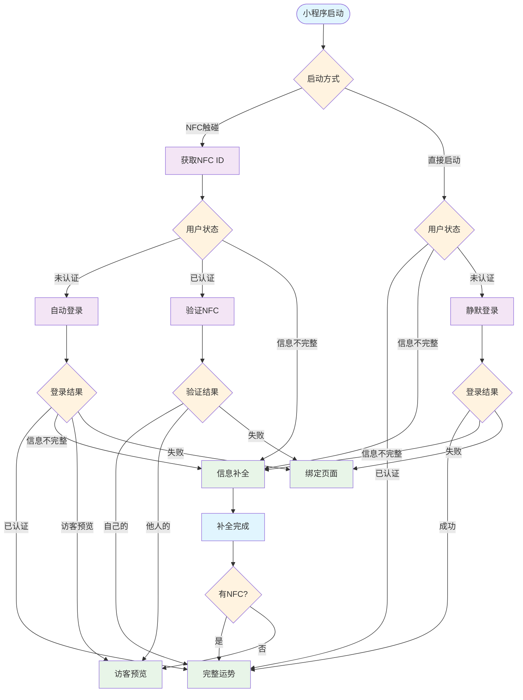

# 微信小程序用户场景流程图文档

## 1. 项目概述

基于NFC技术的微信小程序，支持8种用户场景，通过不同入口和状态组合提供差异化体验。

### 1.1 场景总览

| 场景 | 用户状态   | NFC状态  | 入口 | 结果页面 |
| ---- | ---------- | -------- | ---- | -------- |
| 1    | 未认证     | 他人绑定 | NFC  | 访客预览 |
| 2    | 未认证     | 未绑定   | NFC  | 信息补全 |
| 3    | 未认证     | 无       | 直接 | 绑定引导 |
| 4    | 已认证     | 他人绑定 | NFC  | 访客运势 |
| 5    | 已认证     | 未绑定   | NFC  | 完整运势 |
| 6    | 已认证     | 自己绑定 | NFC  | 完整运势 |
| 7    | 已认证     | 无       | 直接 | 完整运势 |
| 8    | 信息不完整 | 未绑定   | NFC  | 信息补全 |

### 1.2 核心数据

- **微信OpenID**: 用户唯一标识
- **NFC ID**: 手链唯一标识
- **JWT Token**: 认证令牌
- **用户状态**: 未认证/已认证/信息不完整
- **手链状态**: 未绑定/自己绑定/他人绑定

## 2. 系统流程图

### 2.1 完整业务流程

### 2.2 场景对比矩阵

| 场景      | 入口方式 | 用户状态   | NFC状态      | 关键验证点                                              | 页面跳转路径                                      | 最终结果                |
| --------- | -------- | ---------- | ------------ | ------------------------------------------------------- | ------------------------------------------------- | ----------------------- |
| **场景1** | NFC触碰  | 未认证     | 已被他人绑定 | • 微信登录验证 • NFC绑定状态检查                    | 自动登录 → 检查NFC → 生成预览数据 → 访客预览页    | 访客预览运势 + 购买引导 |
| **场景2** | NFC触碰  | 未认证     | 未绑定       | • 微信登录验证 • NFC绑定到用户 • 资料完整性检查 | 自动登录 → 绑定NFC → 检查资料 → 信息补全页/运势页 | 信息补全 → 完整运势     |
| **场景3** | 直接启动 | 未认证     | 无           | • 静默登录尝试 • 登录失败处理                       | 静默登录 → 失败 → 绑定页面 → 等待NFC              | 引导用户绑定手链        |
| **场景4** | NFC触碰  | 已认证     | 已被他人绑定 | • JWT Token验证 • NFC所有权检查                     | 验证NFC权限 → 确认他人手链 → 访客运势页           | 访客运势(功能受限)      |
| **场景5** | NFC触碰  | 已认证     | 未绑定       | • JWT Token验证 • 自动绑定逻辑                      | 验证NFC权限 → 自动绑定 → 完整运势页               | 完整运势 + 历史记录     |
| **场景6** | NFC触碰  | 已认证     | 已被自己绑定 | • JWT Token验证 • NFC所有权确认                     | 验证NFC权限 → 确认所有权 → 完整运势页             | 完整运势 + 历史记录     |
| **场景7** | 直接启动 | 已认证     | 无           | • JWT Token验证 • 资料完整性检查                    | 检查认证状态 → 检查资料 → 运势页/信息补全页       | 完整运势 + 历史记录     |
| **场景8** | NFC触碰  | 信息不完整 | 未绑定       | • JWT Token验证 • 资料完整性检查 • NFC绑定状态  | 登录 → 绑定NFC → 信息补全页 → 运势页              | 信息补全 → 完整运势     |

## 3. 数据流总结

### 3.1 核心验证逻辑

- **微信认证**: 通过uni.login获取code，后端验证生成JWT
- **NFC验证**: 检查手链绑定状态(未绑定/自己绑定/他人绑定)
- **资料验证**: 检查用户姓名和生日是否完整
- **权限验证**: 根据用户状态和NFC状态决定功能权限

### 3.2 页面跳转规则

- **完整运势页**: 已认证+资料完整+有NFC绑定
- **访客运势页**: 未认证或触碰他人手链
- **信息补全页**: 已认证但资料不完整
- **绑定页面**: 未认证且静默登录失败

### 3.3 开发场景配置

通过`dev-scenarios.ts`可模拟8种场景进行测试，支持：

- 模拟不同用户认证状态
- 模拟不同NFC绑定状态
- 模拟不同启动方式
- 快速验证业务逻辑

---

_本文档基于实际代码分析生成，准确反映了系统的真实实现逻辑。_
